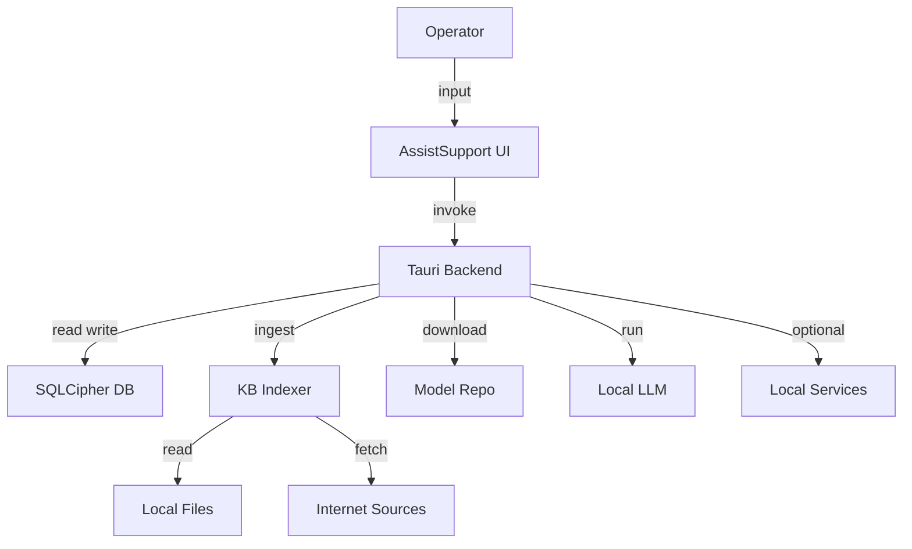

# AssistSupport Threat Model (Local-Only Workstation)

## Executive summary
The top risk themes are (1) **local privilege boundary erosion** via the large Tauri command surface, (2) **untrusted content ingestion** (web/GitHub/files/archives) that can poison retrieval and mislead operators, and (3) **secrets + integrity protection** for local state (SQLCipher DB encryption, keychain/key-store correctness, and model download integrity). Given the confirmed deployment is single-user workstations with internal operational data, the highest realistic attackers are **co-resident local processes/malware**, and the highest-impact outcomes are silent guidance manipulation and credential/token compromise.

## Scope and assumptions
- In-scope paths:
  - `/Users/d/Projects/AssistSupport/src`
  - `/Users/d/Projects/AssistSupport/src-tauri`
  - `/Users/d/Projects/AssistSupport/search-api`
  - `/Users/d/Projects/AssistSupport/services/memorykernel` (only where AssistSupport runs/ships it)
- Out-of-scope:
  - Upstream third-party dependencies internals (modeled as external)
  - Full CI/CD deep dive (only included where it affects build integrity)
- Confirmed context (from user):
  - Internal operational data only (no external/customer data)
  - Single-user local workstations
  - Local/offline-capable operation; data should not leave the machine by design
- Additional assumptions used for ranking (explicit):
  - Local services are expected to bind to `localhost` by default (if any bind non-loopback, several priorities increase materially).
  - Network ingestion (URL/YouTube/GitHub remote) exists in the codebase but is **disabled by policy by default** and only enabled via explicit opt-in flags.

Open questions that would materially change the risk ranking:
- Do any local HTTP services (Search API / MemoryKernel) ever bind to **non-loopback** interfaces in real deployments? (Evidence to check: bind address in `search-api/search_api.py` and memorykernel service main.)
- Are builds distributed in a controlled channel with signing/notarization and endpoint protection that reduces local injection risk? (Evidence anchors: `src-tauri/tauri.conf.json` is only partial; distribution controls likely external.)

## System model
### Primary components
- Desktop UI (React) invoking privileged Tauri commands (evidence: `src/hooks/useInitialize.ts`, Tauri `invoke` usage throughout `src`).
- Tauri backend (Rust) with a large `#[tauri::command]` surface and `generate_handler!` registrations (evidence: `src-tauri/src/lib.rs`, `src-tauri/src/commands/mod.rs`).
- Local persistence:
  - SQLCipher-encrypted SQLite DB (evidence: `src-tauri/Cargo.toml` rusqlite features `bundled-sqlcipher`, `src-tauri/tests/security.rs`).
  - Secure token store/envelope crypto (evidence: `src-tauri/src/security.rs`).
- Knowledge Base subsystem:
  - Disk ingest (evidence: `src-tauri/src/kb/ingest/disk.rs`)
  - Web ingest with DNS pinning (evidence: `src-tauri/src/kb/ingest/web.rs`, `src-tauri/src/kb/dns.rs`)
  - GitHub ingest via subprocess (evidence: `src-tauri/src/kb/ingest/github.rs`)
  - Backup import/export (evidence: `src-tauri/src/backup.rs`)
- Local LLM runtime:
  - GGUF downloads + integrity allowlist (evidence: `src-tauri/src/downloads.rs`, `src-tauri/src/model_integrity.rs`)
  - Model execution through llama.cpp binding (evidence: `src-tauri/Cargo.toml` `llama-cpp-2`)
- Optional local services (depending on how this repo is deployed):
  - Search API (Python Flask) (evidence: `search-api/search_api.py`)
  - MemoryKernel service (Rust Axum) (evidence: `services/memorykernel/.../src/main.rs`)

### Data flows and trust boundaries
- Operator input → React UI → Tauri backend
  - Data: ticket text, prompts, notes, settings, export requests.
  - Channel: Tauri IPC invoke (evidence: `src-tauri/src/lib.rs` handler registration).
  - Security guarantees: desktop app boundary + capability config (evidence: `src-tauri/capabilities/default.json`, `src-tauri/tauri.conf.json`).
  - Validation: uneven per-command validation; some centralized validation exists (evidence: `src-tauri/src/validation.rs`, used in `src-tauri/src/commands/mod.rs`).

- Tauri backend → SQLCipher DB (local file)
  - Data: drafts/templates/variables, settings, audit log, KB indexes, tokens metadata.
  - Channel: local file + SQLite (SQLCipher) (evidence: `src-tauri/src/db/mod.rs`, sqlcipher tests in `src-tauri/tests/security.rs`).
  - Security guarantees: at-rest encryption via SQLCipher; wrong key must fail (evidence: `src-tauri/tests/security.rs`).
  - Validation: query parameterization in rusqlite; additional sanitization exists for certain inputs (evidence: `src-tauri/tests/filter_injection.rs`).

- Tauri backend → KB ingest (disk/web/github/archives)
  - Data: untrusted content (markdown/html/pdf/xlsx/docx, code) and metadata.
  - Channel: filesystem reads; optional HTTP fetch; git subprocess; archive parsing (evidence: `src-tauri/src/kb/ingest/*`, `src-tauri/src/backup.rs`).
  - Security guarantees: path validation for user-selected folders (evidence: `src-tauri/src/validation.rs::validate_within_home`).
  - Validation/limits: file-type max sizes in indexer tests (evidence: `src-tauri/src/kb/indexer.rs` tests), backup ZIP limits (evidence: `src-tauri/src/backup.rs::validate_zip_archive_limits`).

- Tauri backend → Model download + model execution
  - Data: model files from Hugging Face; prompts/context.
  - Channel: HTTPS download, local filesystem, llama.cpp execution (evidence: `src-tauri/src/downloads.rs`, `src-tauri/src/model_integrity.rs`).
  - Security guarantees: allowlist SHA256 verification (evidence: `src-tauri/src/model_integrity.rs`).
  - Validation: model filename and gguf validation command (evidence: `src-tauri/src/commands/mod.rs::validate_gguf_file`).

#### Diagram

## Assets and security objectives
| Asset | Why it matters | Security objective (C/I/A) |
|---|---|---|
| Local SQLCipher DB contents (drafts/templates/settings/audit) | Contains operational guidance, workflow state, and audit evidence | C + I |
| Token material (Hugging Face/Jira/Search API) | Enables access to internal systems or downloads | C |
| KB corpus + chunk index | Drives answer grounding; poisoning can cause wrong instructions | I |
| Model files and allowlist metadata | A tampered model can exfiltrate or generate malicious guidance | I |
| Audit log | Provides accountability for overrides and sensitive actions | I + A |
| Availability of app and core workflow | Support engineers need consistent uptime | A |

## Attacker model
### Capabilities
- Co-resident local process/malware with user-level access (most realistic in this context).
- Ability to provide untrusted inputs: documents, archives, URLs, GitHub repos, and ticket text.
- Ability to observe operator actions (clipboard, exported files) depending on workstation posture.

### Non-capabilities
- No internet-facing multi-tenant service exposure is assumed by default.
- No external attacker with arbitrary network reach is assumed unless services bind non-loopback.
- No privileged (root) attacker is assumed as baseline (if present, most controls can be bypassed).

## Entry points and attack surfaces
| Surface | How reached | Trust boundary | Notes | Evidence (repo path / symbol) |
|---|---|---|---|---|
| Tauri command surface | UI `invoke` → Rust | UI → backend | Large surface; high impact if renderer compromised | `src-tauri/src/lib.rs`, `src-tauri/src/commands/mod.rs` |
| Backup import/preview | operator selects file | file → backend | Untrusted ZIP; must enforce limits and path rules | `src-tauri/src/backup.rs::validate_zip_archive_limits` |
| Disk KB ingest | operator selects folder | file → backend | Must stay within home/sensitive dir blocks | `src-tauri/src/validation.rs::validate_within_home` |
| Web ingest | operator supplies URL | internet → backend | SSRF + rebinding risk; DNS pinning critical | `src-tauri/src/kb/ingest/web.rs`, `src-tauri/src/kb/dns.rs` |
| GitHub ingest | operator supplies repo URL | internet → subprocess | Subprocess + repo content poisoning | `src-tauri/src/kb/ingest/github.rs` |
| Model download | operator downloads model | internet → backend | Supply chain + integrity verification | `src-tauri/src/downloads.rs`, `src-tauri/src/model_integrity.rs` |
| Clipboard copy/export | operator clicks copy/export | UI → OS | Risk of sharing ungrounded answers; now gated and audited | `src/components/Draft/ResponsePanel.tsx`, `src-tauri/src/commands/mod.rs::audit_response_copy_override` |
| Local services (optional) | local HTTP | local → service | Only relevant if enabled/shipped/bound | `search-api/search_api.py`, `services/memorykernel/.../main.rs` |

## Top abuse paths
1. **Poison KB grounding to influence operator actions**
   1) Attacker provides a “policy-looking” markdown/doc that is incorrect.
   2) Operator ingests folder.
   3) KB search surfaces the poisoned chunk with high score.
   4) LLM generates plausible response with citations to the poisoned doc.
   5) Operator copies/exports and acts on it.
   Impact: incorrect support actions; operational harm.

2. **Archive import DoS via decompression bomb**
   1) Attacker supplies a crafted ZIP with extreme entry count or huge uncompressed size.
   2) Operator previews/imports backup.
   3) App exhausts memory / stalls.
   Impact: availability loss; potential data corruption risk if partial import.

3. **Model supply-chain substitution**
   1) Attacker manipulates network path or mirrors a model under same name.
   2) Operator downloads the model.
   3) If integrity checks are absent/bypassed, a malicious model runs.
   Impact: guidance manipulation; potential data exfil through output channels.

4. **Renderer compromise → privileged backend misuse**
   1) Malicious content or local injection compromises renderer context.
   2) Attacker triggers Tauri commands for exports, settings, token ops, ingest.
   3) Sensitive local state is exfiltrated via export or printed output.
   Impact: confidentiality + integrity compromise.

5. **SSRF / DNS rebinding to internal metadata endpoints (if web ingest enabled)**
   1) Operator ingests a URL.
   2) URL resolves to public IP at validation time, then rebinds to private/localhost.
   3) Fetcher pulls sensitive local endpoints.
   Impact: data leakage, internal network probing.

## Threat model table
| Threat ID | Threat source | Prerequisites | Threat action | Impact | Impacted assets | Existing controls (evidence) | Gaps | Recommended mitigations | Detection ideas | Likelihood | Impact severity | Priority |
|---|---|---|---|---|---|---|---|---|---|---|---|---|
| TM-001 | Co-resident malware | Renderer context compromised or IPC abused | Invoke privileged commands to export data / alter settings | C/I compromise | DB contents, tokens, audit | Capability config exists; some validation (`src-tauri/capabilities/default.json`, `src-tauri/src/validation.rs`) | Large command surface; uneven per-command checks | Reduce command surface; centralize validation for file/network operations; harden CSP and window isolation | Audit anomalous command bursts; log export/import + token events | Medium | High | high |
| TM-002 | Untrusted KB content author | Operator ingests attacker-controlled docs | Poison KB so answers are wrong but “cited” | Integrity loss | KB corpus, operator actions | Copy gating requires citations + answer mode; override audited (`src/components/Draft/ResponsePanel.tsx`) | Citations don’t guarantee correctness; no content provenance scoring | Add source provenance tags and “trust tier”; add “KB quarantine” for new sources; add drift alerts for policy docs | Track source IDs used per answer; alert on new/unknown sources dominating | High | Medium | high |
| TM-003 | Malicious backup file | Operator imports backup | Decompression bomb or huge JSON causes resource exhaustion | Availability loss | App availability | ZIP safety limits (`src-tauri/src/backup.rs::validate_zip_archive_limits`) | Limits tuned but may need field validation of JSON structure | Keep limits conservative; validate expected file set; reject unexpected entries; progressive streaming parse if needed | Log rejected backups with reason and file hash | Medium | Medium | medium |
| TM-004 | Network attacker / mirror | Operator downloads model | Model substitution if verification bypassed | I/C risk via output channels | Model integrity, DB content via output | SHA allowlist (`src-tauri/src/model_integrity.rs`), pinned model sources (`src-tauri/src/downloads.rs`) | Allowlist update process must stay strict; user-provided models remain a risk | Default strict mode; warnings on custom models; show model provenance in UI | Audit model load events; log SHA mismatch attempts | Low | High | medium |
| TM-005 | Web attacker | Web ingest enabled | SSRF / rebinding to private IPs | C leakage | Tokens, local services | DNS pinning + private IP blocks (`src-tauri/src/kb/dns.rs`, `src-tauri/tests/ssrf_dns_rebinding.rs`) | Any bypass in URL validation is high impact | Keep URL allowlist strict; prefer explicit domains allowlist if possible; limit redirects | Log fetch target + pinned IP set; alert on blocked private targets | Low-Med | High | high |
| TM-006 | Local attacker | Access to filesystem | Attempt to access sensitive dirs via KB folder path | C leakage | Credentials in ~/.ssh etc | Home + sensitive-dir blocking (`src-tauri/src/validation.rs`) | Coverage depends on call sites consistently using validation | Enforce validation at all folder selection entry points; add tests for every ingest path | Audit blocked path attempts | Low | High | medium |
| TM-007 | Local attacker | Can read DB file but not keys | Offline DB exfil | Confidentiality | DB contents | SQLCipher + wrong-key tests (`src-tauri/Cargo.toml`, `src-tauri/tests/security.rs`) | Key management path must be correct in runtime | Ensure keychain fallback is encrypted; document reset behavior | Audit key rotation / unlock failures | Low | High | medium |
| TM-008 | Operator error | Copy/export without citations | Disseminate ungrounded answers | Integrity + compliance risk | Operator actions | Copy gating + override audit (`src/components/Draft/ResponsePanel.tsx`, `src-tauri/src/commands/mod.rs`) | Other copy paths may exist; exports may need similar gating | Apply same gating to all export/share routes; make “no citations” state prominent | Audit override events; trend report | Medium | Medium | medium |

## Criticality calibration
For this repo/context (single-user workstation, internal operational data, offline-capable):
- Critical:
  - Local compromise that silently alters guidance at scale across operators (via poisoned KB + high confidence).
  - Any path that exposes stored tokens/credentials to untrusted processes.
  - Any non-loopback service exposure without auth (if present).
- High:
  - Renderer compromise → backend command misuse to export secrets or tamper settings.
  - SSRF/rebinding that reads local metadata endpoints or internal services (if web ingest used).
  - Model integrity bypass leading to execution of tampered model.
- Medium:
  - Availability loss via import bombs that is recoverable but disrupts operations.
  - Operator overrides that bypass grounding checks without adequate audit visibility.
- Low:
  - Non-sensitive fingerprinting of local status endpoints in localhost-only mode.

## Focus paths for security review
| Path | Why it matters | Related Threat IDs |
|---|---|---|
| `/Users/d/Projects/AssistSupport/src-tauri/src/lib.rs` | Defines privileged command surface and blast radius | TM-001 |
| `/Users/d/Projects/AssistSupport/src-tauri/src/commands/mod.rs` | Tauri commands; validation consistency; audit hooks | TM-001, TM-008 |
| `/Users/d/Projects/AssistSupport/src-tauri/src/validation.rs` | Core path + size validation; must be used everywhere | TM-006 |
| `/Users/d/Projects/AssistSupport/src-tauri/src/backup.rs` | Backup import limits + path hygiene | TM-003 |
| `/Users/d/Projects/AssistSupport/src-tauri/src/model_integrity.rs` | Model allowlist + strict verification | TM-004 |
| `/Users/d/Projects/AssistSupport/src-tauri/src/downloads.rs` | Model source selection + pinned metadata | TM-004 |
| `/Users/d/Projects/AssistSupport/src-tauri/src/db/mod.rs` | SQLCipher DB open + key usage and migration | TM-007 |
| `/Users/d/Projects/AssistSupport/src-tauri/src/security.rs` | Key wrapping, token encryption, export crypto | TM-007 |
| `/Users/d/Projects/AssistSupport/src-tauri/src/kb/ingest/web.rs` | Web ingestion, redirect handling, fetch policy | TM-005 |
| `/Users/d/Projects/AssistSupport/src-tauri/src/kb/dns.rs` | DNS pinning and private IP blocking | TM-005 |
| `/Users/d/Projects/AssistSupport/src-tauri/src/kb/ingest/github.rs` | Subprocess + repo content ingestion | TM-002 |
| `/Users/d/Projects/AssistSupport/src/components/Draft/ResponsePanel.tsx` | Copy gating + audit override UX | TM-008 |

## Quality check
- Entry points covered: Tauri IPC, backup import, KB ingest (disk/web/github), model download, exports/copy, optional local services.
- Trust boundaries represented in threats: UI→backend, backend→DB, backend→internet, backend→filesystem, backend→LLM.
- Runtime vs CI/dev separation: runtime surfaces prioritized; CI only indirectly.
- User clarifications reflected: single-user local workstations, internal operational data, local/offline requirement.
- Assumptions/open questions explicit: non-loopback binding and web ingest intent remain key.
